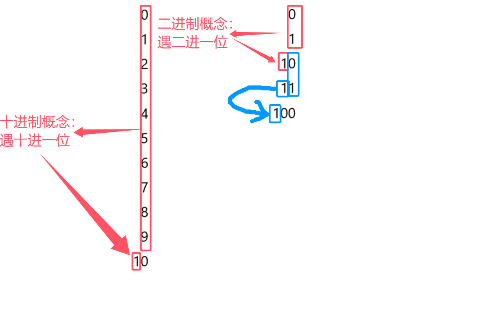

# 前言：快捷的学习方法
1、理解语法构成和含义
2、必要的死记硬背
3、多敲多练（这个是重点）
# 一、程序文件的基础结构
一个代码块可以简单分成三个部分
​​​​​​​​​​
***
看下图，不同的颜色代表不同的部分，还可以发现，这三者首字母都是大写的，如果是变量名称，首字母就不大写了，可以有这么些印象

写代码常常需要引用命名空间，例如，只有引用了System这个命名空间，Console才能在别的命名空间Lesson1里使用，也就是说，Console其实就是System工具包里的一个工具
***
# 二、控制台输入输出语句
## 1、学习
（开头的四段代码是为了方便复习，请先看后面的内容来理解）
```csharp
Console WriteLine("...");
Console Write("...");
Console ReadLine();
Console ReadKey();
```
## 2、理解

其实WriteLine可以理解为占用了一整行，无论你输入什么，都会用看不见的空格把那一整行填满
另外，引号内的内容对符号没有特殊要求，也就是说里面输入中文的标点符号也没有问题


## 3、习题


***
# 三、变量
分类：整型（分有无符号），浮点型，布尔型bool，字符型char，字符串型string
## 1、折叠代码

在折叠的代码里还可以继续折叠代码

本质是 编辑器提供给我们的 预处理指令
它只会在编辑时有用 发布了代码 或执行代码 它会被自动删除
## 2、变量类型


共有14种变量类型，都尽量记一记
### 有符号的整型变量
变量的使用不能无中生有，必须先声明


“+”只是把两个东西连在一起，不会在中间产生空格


### 无符号的整型变量

### 浮点数（小数）

且这个f是有小数的时候才加，如果没有小数，就可以直接float f=80;不用加f


### 特殊类型


char类型是16位无符号整数

## 3、为什么有那么多不同类型的变量


## 4、变量要先初始化

## 5、练习


***
# 四、变量的本质
## 1、变量的存储空间（内存中）（字节数要记，会卡面试题）


sizeof()的结果是int类型的
### 有符号


### 无符号


### 浮点数


### 特殊类型


## 2、变量的本质是什么

## 3、二进制和十进制的相互转化
### 十进制转二进制


补充一下：所得余数 倒序数出来后，前面还要加最后的一个商（其实就是图中计算后，从下往上看 右边的数）
### 二进制转十进制

注意从右往左看的第一个数在第0位，如果是二进制的1，则转换成2的0次方
### 字节的存储


### 有无符号的原因


现在只需理解整数的二进制就行了，理解了它，就能理解为什么 不同的存储空间就意味着它的存储范围不一样
## 4、练习


可用电脑自带计算机验证结果


calculate就是计算的英文
***
# 五、变量的命名规则
## 1、必须遵守的规则

“.”和“ ”都算是特殊符号（点和空格）
## 2、常用命名规范

***
# 六、常量
## 1、基础语法

## 2、常量的特点


***
# 七、转义字符
## 1、什么是转义字符


注意对角线的方向，是向右倾斜的

## 2、常用的转义字符（必记）


## 3、不常用的转义字符（了解）


alarm就是警报的意思，所以是\a
## 4、如何禁用转义字符

当我们想要在字符串中打印斜杠时，会因为斜杆的转义作用而报错

这个时候可以双斜杠，第一条斜杠负责转义，第二条斜杠负责打印出来
不过，我们也可以直接禁用转义字符


## 5、练习


***
# 附快捷键
按住Ctrl、K+C——注释

按住Ctrl、K+U——取消注释

Ctrl+F5——运行代码


