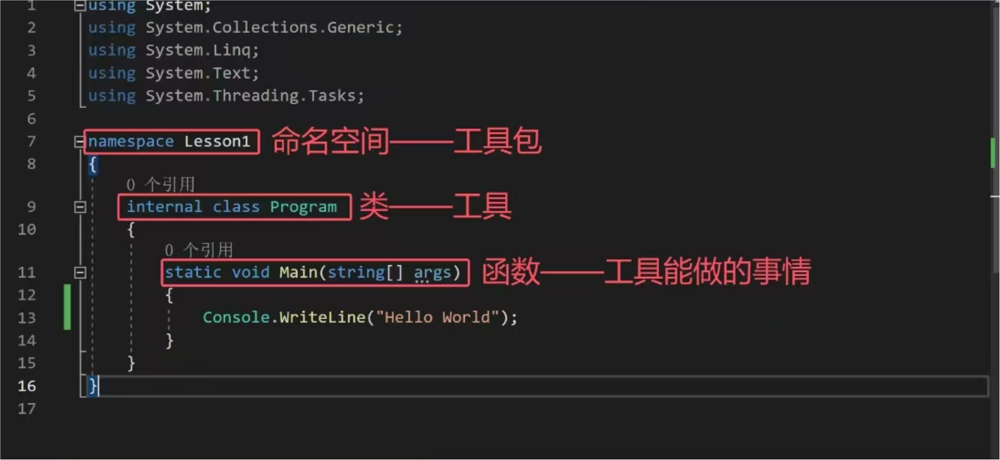
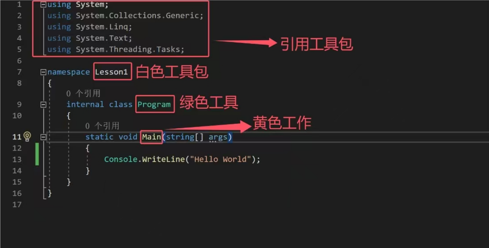

# 前言：快捷的学习方法
1、理解语法构成和含义

2、必要的死记硬背

3、多敲多练（这个是重点）
# 一、程序文件的基础结构
一个代码块可以简单分成三个部分
​​​​​​​​​​

看下图，不同的颜色代表不同的部分，还可以发现，这三者首字母都是大写的，如果是变量名称，首字母就不大写了，可以有这么些印象


写代码常常需要引用命名空间，例如，只有引用了System这个命名空间，Console才能在别的命名空间Lesson1里使用，也就是说，Console其实就是System工具包里的一个工具

# 二、控制台输入输出语句
#  1、学习
（开头的四段代码是为了方便复习，请先看后面的内容来理解）
```
Console WriteLine("...");
Console Write("...");
Console ReadLine();
Console ReadKey();
```
